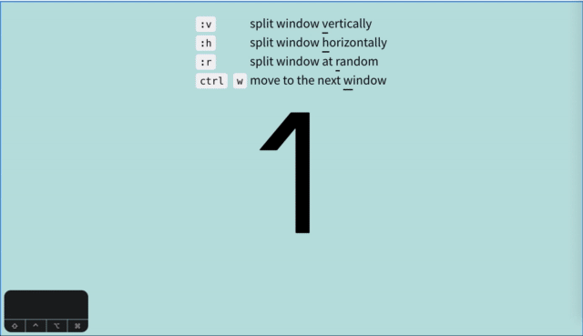

# Dynamic CSS Grid
Dynamically split row and column with CSS Grid. [The demo is here.](https://schifzt.github.io/dynamic-css-grid/)

## key-binding
+ `:v`      : split window vertically 
+ `:h`      : split window horizontally 
+ `:r`      : split window at random 
+ `Ctrl`+`w`: move to the next window

## LICENSE
MIT
